# fccview-degoog-extensions

**Test / experimental pack — not stable.** This repository is for trying changes and plugins; things may break, disappear, or change without notice. Prefer the upstream **fccview** extensions if you need something dependable for day-to-day use.

Maintainer: **Lukasw**.

---

## Installing this pack in Degoog

This repo is a **Degoog Store** bundle, not an npm package. You do **not** run `npm install` inside this folder to get plugins into Degoog.

1. **Host the git repo** somewhere your Degoog server can clone (usually **GitHub**, GitLab, or similar). A copy that only lives on your PC or Nextcloud is not enough until you **push** it to a remote.
2. In Degoog: **Settings → Store → Add** (or equivalent).
3. Paste the **clone URL**, e.g. `https://github.com/YOUR_USER/YOUR_REPO.git` (must be `https` and usually ends in `.git`).
4. After the repo is added, open the **Store** tab, pick this pack, and **Install** the plugins/themes/engines you want. Adding the repo alone does not install everything automatically.
5. For **updates**: use **Refresh** on the repo in Store, then reinstall or rely on Degoog’s update behaviour for installed items.

**If it still fails:** confirm the server can reach git (no firewall blocking GitHub), the repo is **public** (or the server has credentials for private repos), and the default branch contains a valid root **`package.json`** with matching `plugins/...` paths. See [Degoog Store docs](https://fccview.github.io/degoog/store.html).

Official pack (for comparison): `https://github.com/fccview/fccview-degoog-extensions.git`

---

Plugins

### Weather

Shows weather information using Open-Meteo. Command plugin: run it to get current conditions for a location.

Screenshot

### Define

Look up word definitions using the Free Dictionary API. Command: type a word to get definitions, phonetics, and example usage.

Screenshot

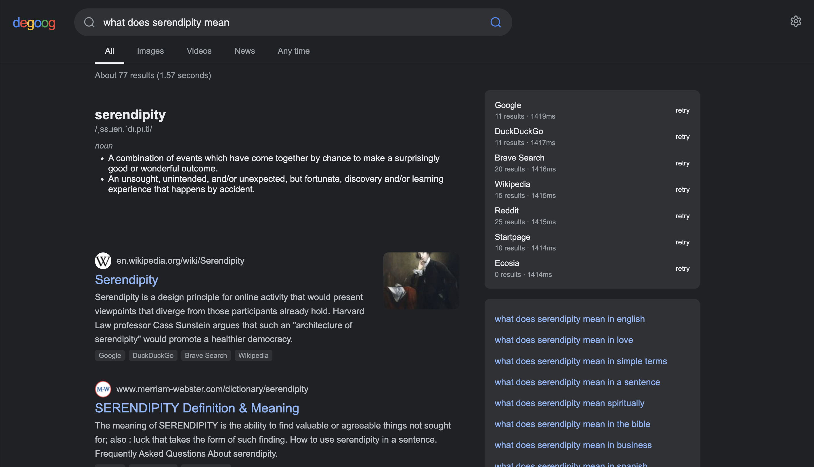

### Time

Show current time in a timezone or city. Command plugin that displays the time for the given place or timezone.

Screenshot

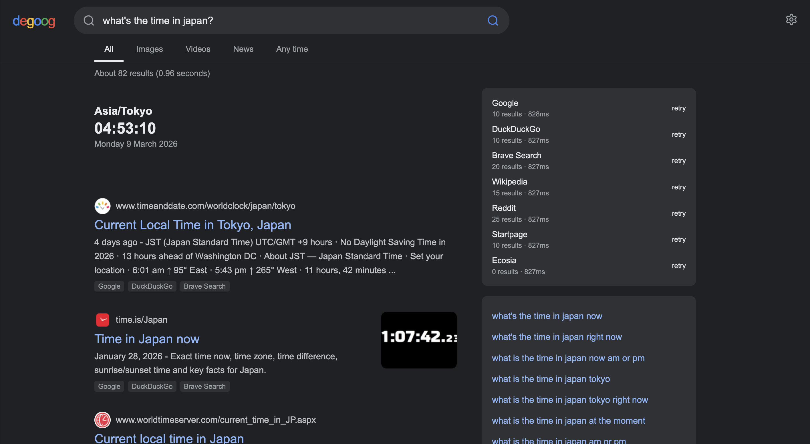

### QR Code

Generate a QR code for a URL. Command: pass a URL to get a scannable QR code.

Screenshot

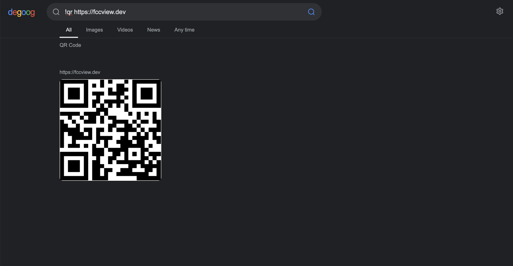

### Password

Generate a random password. Command plugin that creates a secure random password on demand.

Screenshot

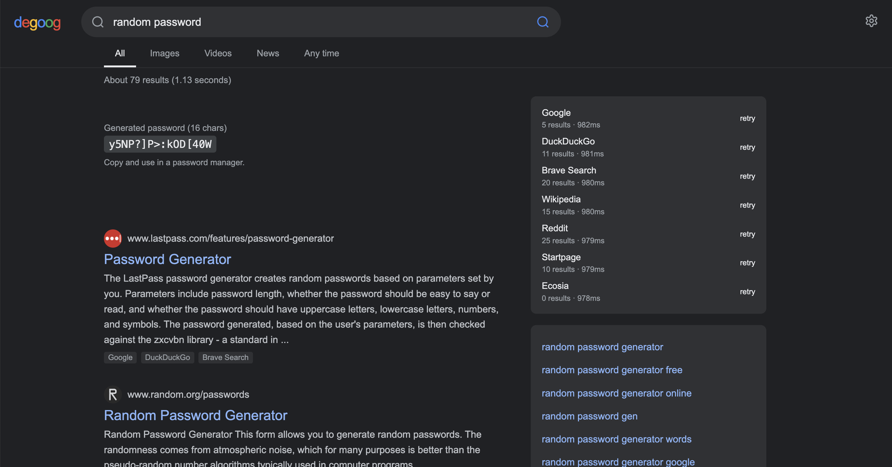

### Search history

Stores search history in `data/history.json` with timestamps. Use `!history` to see a paginated, deletable list of past searches.

Screenshot

### TMDb

Shows movie and TV show details above search results. Slot plugin: when results include TMDb links, it displays poster, rating, and summary in a card above the results.

Screenshot

### Math

Evaluates math expressions and shows the result above search results. Slot plugin: type an expression in the search bar to get the computed result in a slot.

Screenshot

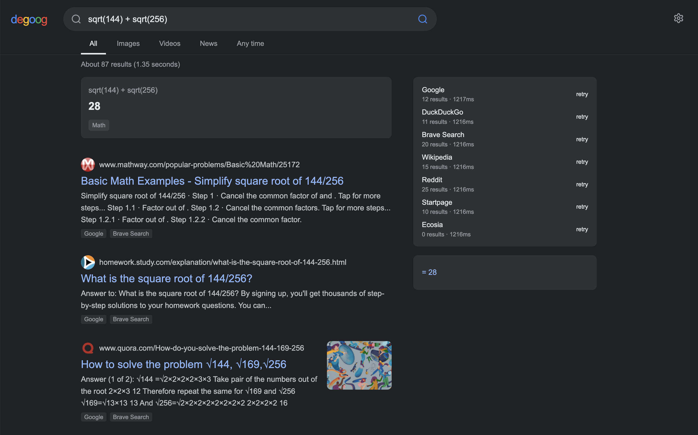

### Snake

Classic Snake command: `!snake` / `!snake-game` or natural language; field size, speed, themes, and food count.

Screenshots

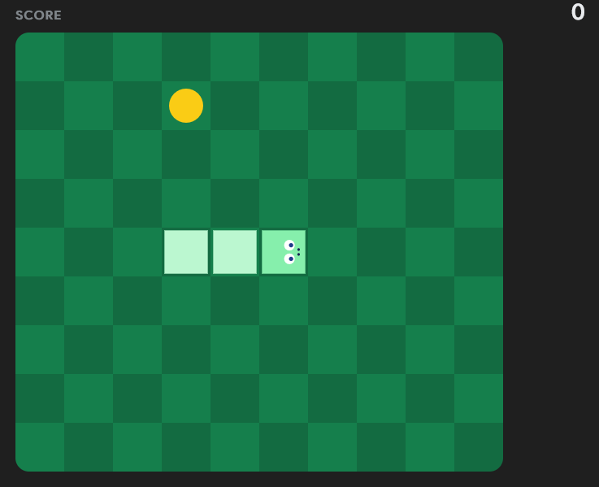
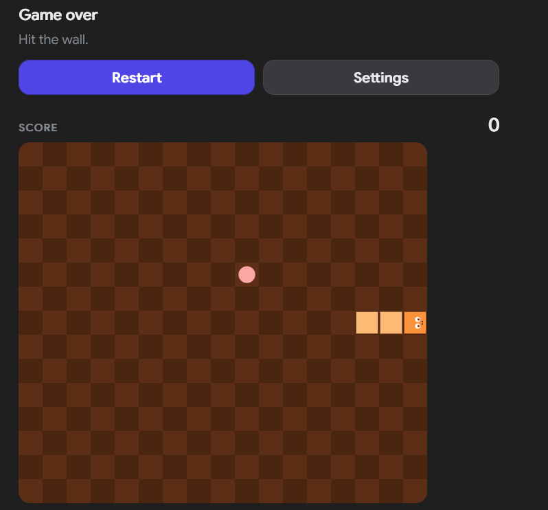

### Coin flip

3D coin flip: `!coinflip` / `!flip` with spin animation and spin-again in the card.

Screenshot

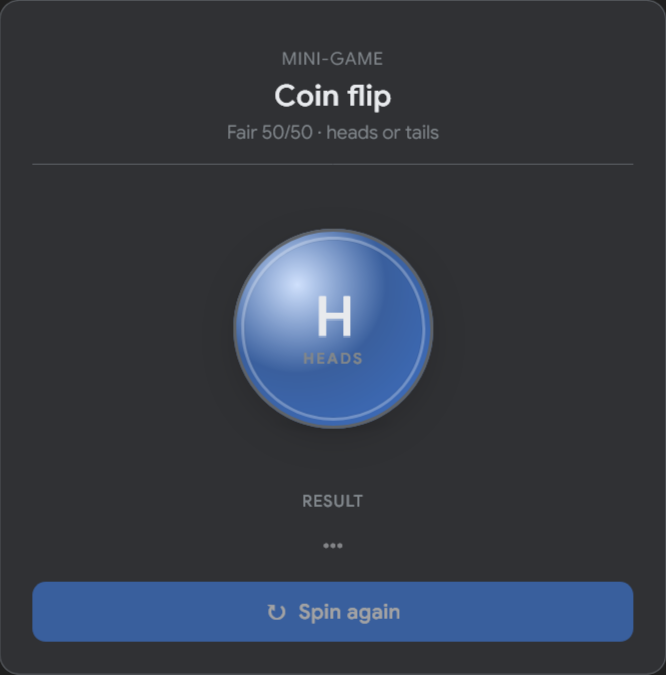

### Random number

Random number generator: `!random` / `!rng` with min/max, optional decimals and decimal places.

Screenshot

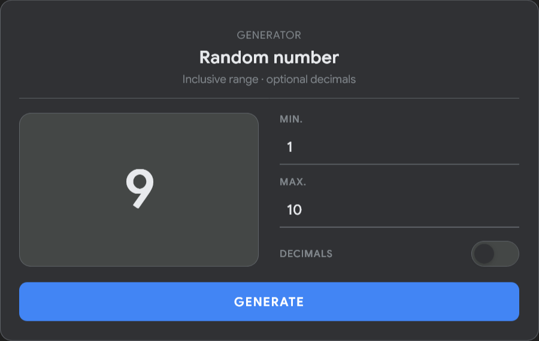

### Jellyfin

Search your Jellyfin media library. Command plugin: query your Jellyfin server for movies, shows, and other media.

Screenshot

### Meilisearch

Search across your Meilisearch indexes. Command plugin: run searches against your Meilisearch instance from the search bar.

Screenshot

### Home RSS Feeds

Shows RSS feed items above search results. Slot plugin: configured feeds are displayed in a slot on the home/search page.

Screenshot

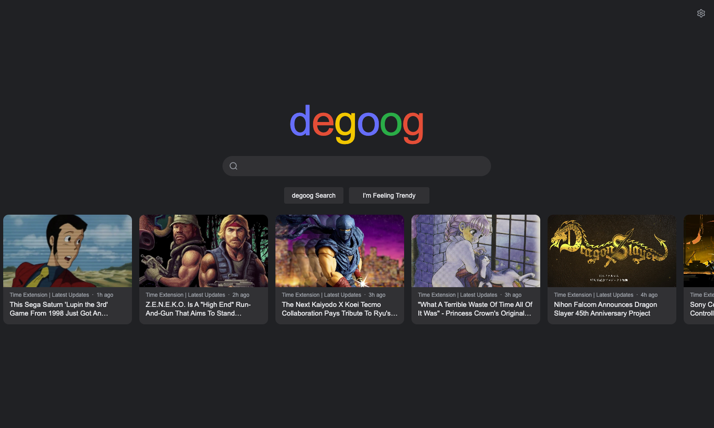
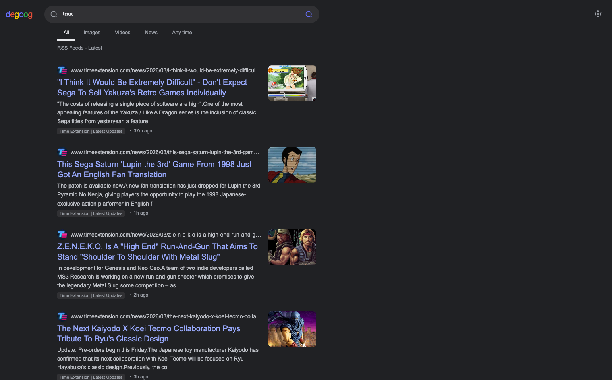
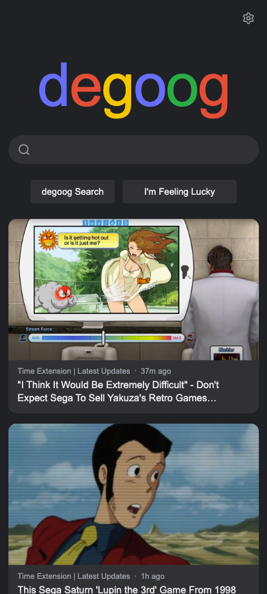

### GitHub

When search results include GitHub repos or users, shows styled info above results. Slot plugin that renders GitHub cards (repo stats, user info) in a slot.

Screenshot

### Result date badges

Slot plugin: **date badge** on each **web** result (snippet, title, `<time>`, URL path). Packaged as **`plugins/result-date-badges`** so Store install does not clash with an old **`result-dates`** folder under `data/plugins/`. Details: [plugins/result-date-badges/README.md](plugins/result-date-badges/README.md).

---

Themes

### Zen

A minimalist calming theme. Overrides the default degoog look with a simple, low-noise layout and colors.

Screenshot

### Catppuccin

Catppuccin palette: Mocha (blue), Latte (light blue), Rose (red/coral), Peach (orange/amber). Multiple flavor options.

Screenshot

### Pokemon

Starter-inspired color schemes: Pikachu (yellow), Bulbasaur (green), Charmander (orange), Squirtle (blue).

Screenshot

---

Transports

### FlareSolverr

Bypass Cloudflare challenges via a [FlareSolverr](https://github.com/FlareSolverr/FlareSolverr) instance. Once configured, engines can select "flaresolverr" as their outgoing transport. Requires a running FlareSolverr instance.

Screenshot

---

Engines

### DuckDuckGo Images

Adds the very powerful DDG images search engine to degoog, adding an extra ~70 images per page to the image results.

Screenshot

### Ecosia

Adds the Ecosia search engine to degoog. Ecosia may return no results when Cloudflare blocks server-side requests; use another engine if that happens.

Screenshot

### Startpage

Adds the Startpage engine to degoog. You can enable Anonymous View so result links open via Startpage's proxy.

Screenshot

### Internet Archive

Adds the Internet Archive as a file-type engine. Searches archive.org for downloadable files, books, software, and media.

Screenshot

### Brave API Search

Adds the Brave Search API as a web engine. Requires a free API key from brave.com/search/api (2,000 queries/month on the free tier).

Screenshot

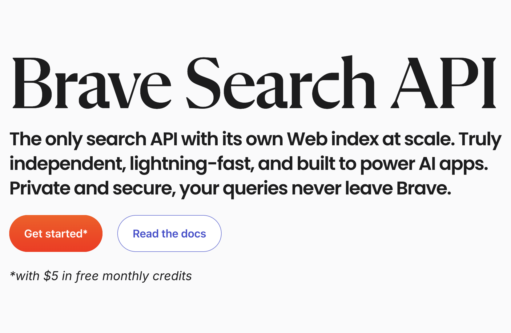

